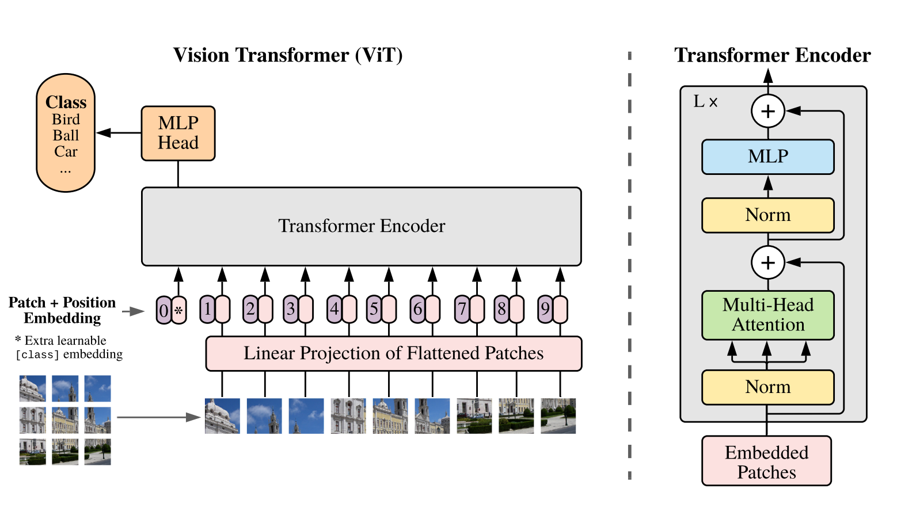
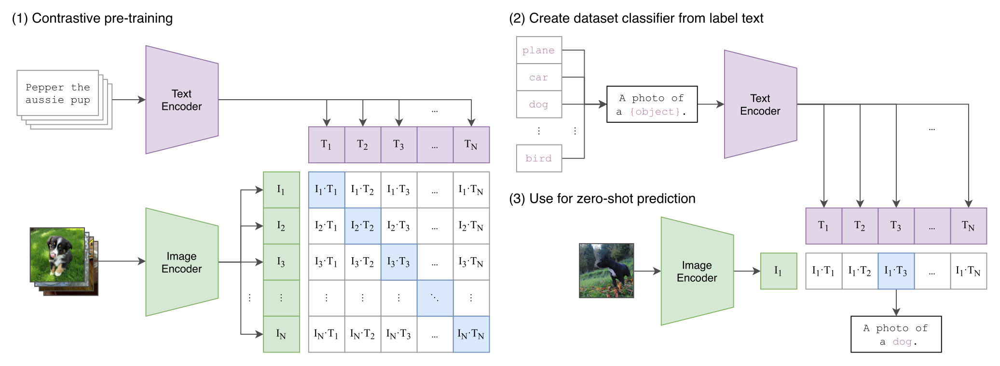
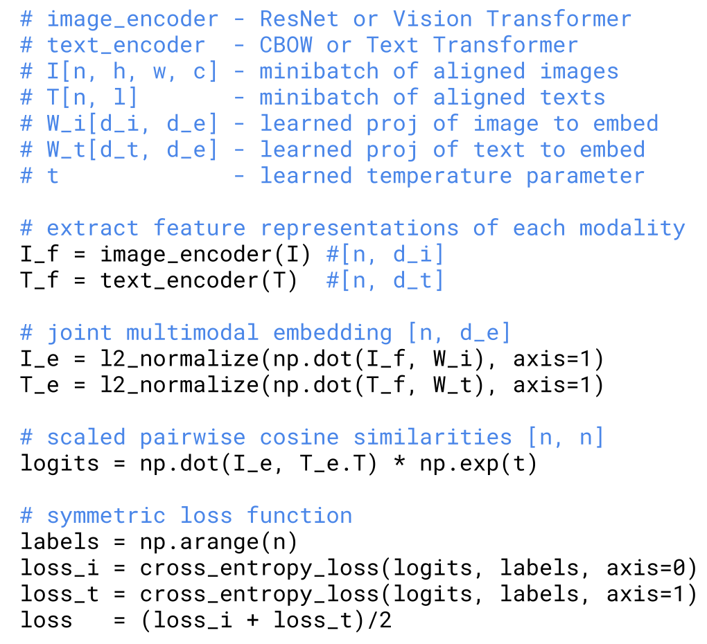
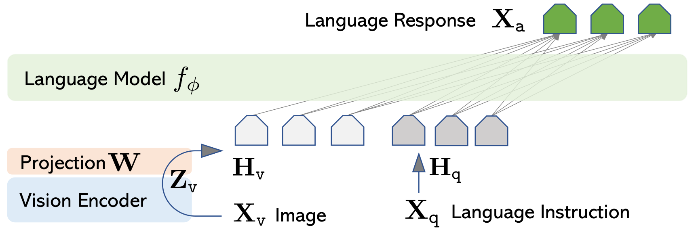
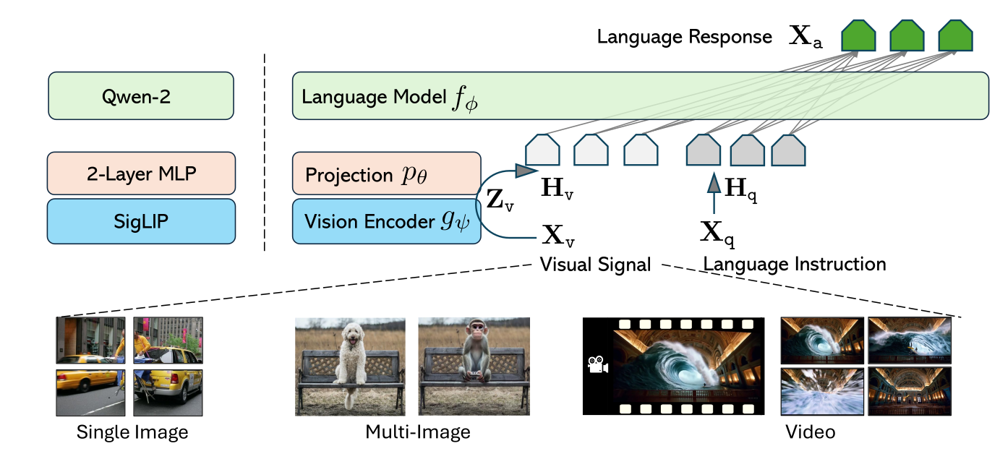
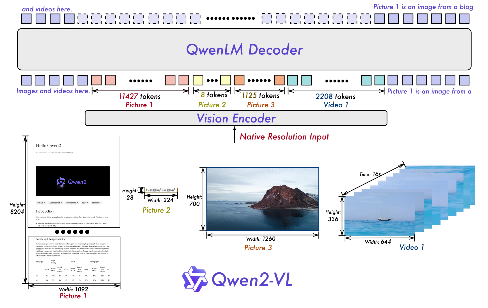
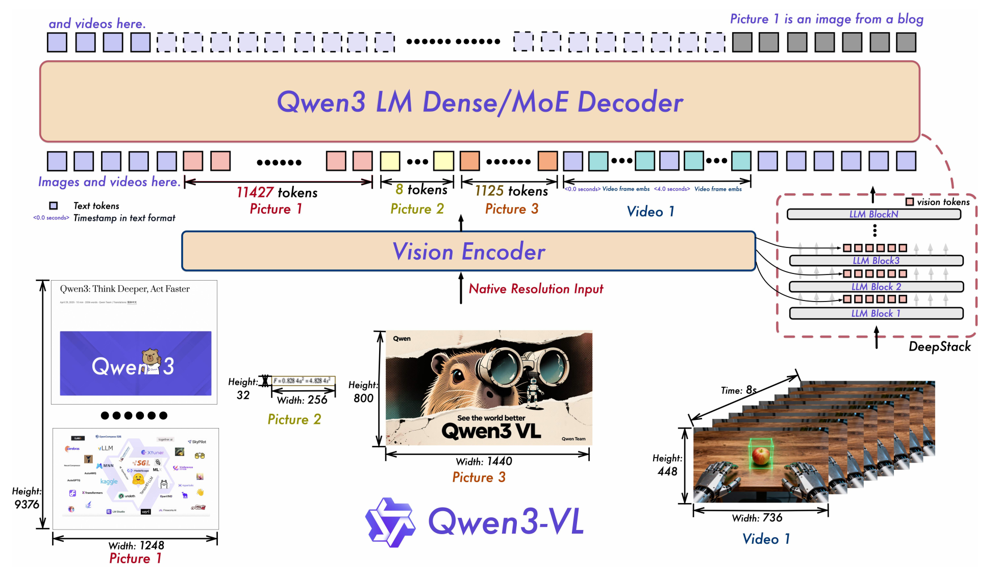
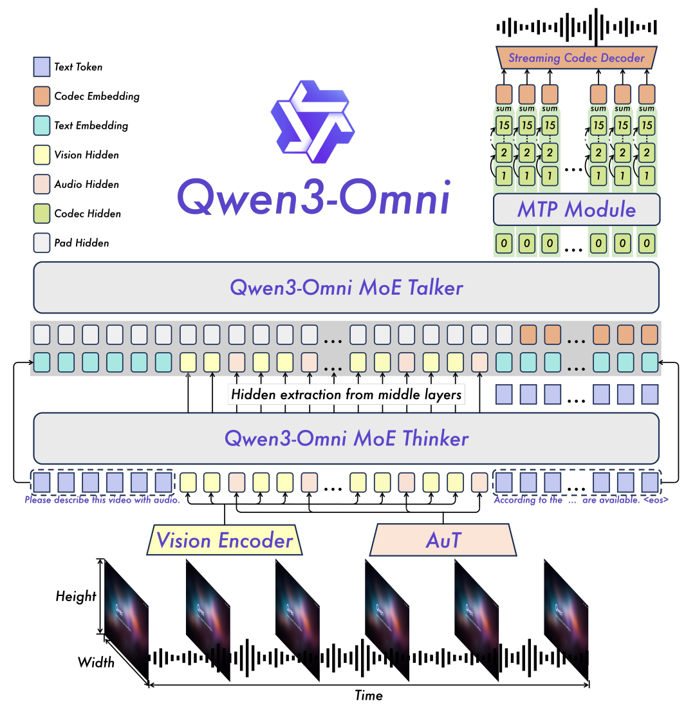
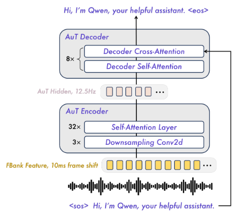

```
Tags: #CS336 #Multimodality #VisionLanguage
Desc: Notes from CS336 Lecture 17 on multimodality, visual encoders, image-token injection, and omni model design.
```

# Lecture 17: Alignment - Multimodality

> Lecture : https://www.youtube.com/watch?v=26FtD08ZpOU&list=PLoROMvodv4rMqXOcazWaTUHhq-yembLCV&index=17 \
> Slides: https://cs336.stanford.edu/lectures/?trace=lecture_17

# Keywords

> CLIP, LLAVA, QWEN VL, Multimodality

# Lectures Notes

课程大纲

- Encoding images
- Injecting image encodings into LLMs
- Towards Omni models

## ViT



## CLIP

自然语言可以作为通用的视觉监督

> https://arxiv.org/abs/2103.00020




pseudocode



## llava

Image -> Vision Encoder: CLIP -> Projection -> LM



llava onevision



## Qwen-VL

Qwen2-VL



Qwen3-VL



# Explore

## Omni Model

Qwen3-Omni



AuT


